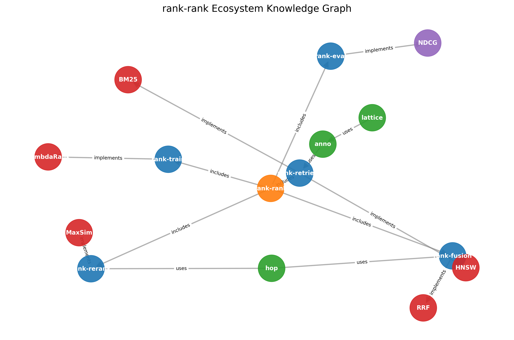

# lattice

Knowledge graph construction and embedding inference for Rust.

## Structure & Visualizations

The `lattice` ecosystem integrates closely with `rank-rank`:



This graph visualizes the dependencies and relationships within the `rank-rank` ecosystem, generated using `lattice`'s own data structures (exported to NetworkX for plotting).

## Overview

`lattice` provides:

- **Core types**: Triple, Entity, Relation, KnowledgeGraph
- **RDF 1.2 formats**: N-Triples, N-Quads, Turtle, JSON-LD
- **KGE inference**: TransE, RotatE, ComplEx scoring (via ONNX)
- **Link prediction**: Find missing edges in knowledge graphs

## Installation

```toml
[dependencies]
lattice = "0.1"

# For KGE inference with ONNX
lattice = { version = "0.1", features = ["onnx"] }
```

## Usage

### Building a Knowledge Graph

```rust
use lattice::{KnowledgeGraph, Triple};

let mut kg = KnowledgeGraph::new();

kg.add_triple(Triple::new("Apple", "founded_by", "Steve Jobs"));
kg.add_triple(Triple::new("Apple", "headquartered_in", "Cupertino"));
kg.add_triple(Triple::new("Steve Jobs", "born_in", "San Francisco"));

// Query relations
let apple_rels = kg.relations_from("Apple");
assert_eq!(apple_rels.len(), 2);

// Find paths
let path = kg.find_path("Apple", "San Francisco");
assert!(path.is_some());

// Statistics
let stats = kg.stats();
println!("Entities: {}, Triples: {}", stats.entity_count, stats.triple_count);
```

### RDF Formats (RDF 1.2)

Supports modern RDF 1.2 specifications (2024):

```rust
use lattice::{KnowledgeGraph, formats::{NTriples, NQuads, Turtle, JsonLd}};

// N-Triples (line-based, simple)
let kg = NTriples::from_str(ntriples_content)?;
let output = NTriples::to_string(&kg)?;

// N-Quads (triples with named graphs)
let graphs = NQuads::read(reader)?;
let merged = NQuads::read_merged(reader)?;

// Turtle (human-readable)
let turtle = Turtle::to_string(&kg)?;

// JSON-LD (linked data)
let jsonld = JsonLd::to_string(&kg)?;
let kg = JsonLd::from_str(jsonld_content)?;
```

### Loading from anno export

```bash
# Export from anno
anno export -i documents/ -o kg/ --format ntriples
```

```rust
use lattice::KnowledgeGraph;

let kg = KnowledgeGraph::from_ntriples_file("kg/document.nt")?;
```

### KG Embedding Inference

Models are trained in Python and exported to ONNX:

```python
# train_kge.py
from pykeen.pipeline import pipeline

result = pipeline(
    model='TransE',
    dataset='your_data',
    training_kwargs={'num_epochs': 100}
)

# Export for Rust inference
result.save_to_directory('model/')
# Then convert to ONNX format
```

```rust
use lattice::embed::{TransEOnnx, KGEmbedding};

// Load pre-trained model
let model = TransEOnnx::from_file(
    "model/transE.onnx",
    "model/entities.json",
    "model/relations.json"
)?;

// Score a triple
let score = model.score("Apple", "founded_by", "Steve Jobs")?;

// Link prediction: (Apple, founded_by, ?)
let candidates = model.predict_tail("Apple", "founded_by", 10)?;
for c in candidates {
    println!("{}: {:.3}", c.entity, c.score);
}
```

## Crate Structure

```
lattice/
├── lattice-core/    # Core types (Triple, Entity, KnowledgeGraph)
├── lattice-embed/   # KGE inference (ONNX models)
└── lattice/         # Facade crate
```

## Integration

### With anno (entity extraction)

```
Documents
    ↓
anno (NER, relations)
    ↓
anno export --format ntriples
    ↓
lattice (KG construction, inference)
```

### With rank-retrieve (retrieval)

```rust
use lattice::KnowledgeGraph;
use rank_retrieve::dense::HnswIndex;

// Build entity embeddings from KGE
let kg = KnowledgeGraph::from_ntriples_file("kg.nt")?;
let kge = TransEOnnx::from_file(...)?;

// Index entity embeddings for fast retrieval
let mut index = HnswIndex::new(kge.embedding_dim());
for entity in kg.entities() {
    let embedding = kge.entity_embedding(&entity.id.as_str())?;
    index.add(&embedding);
}

// Semantic entity search
let query_embedding = kge.entity_embedding("Apple")?;
let similar = index.search(&query_embedding, 10);
```

## License

MIT OR Apache-2.0
