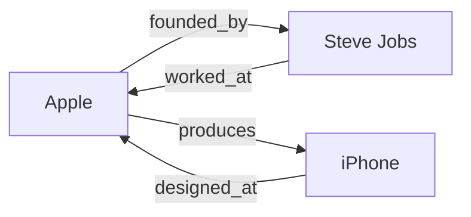

<p align="center"><b>lattix</b></p>



Knowledge graph construction, analysis, and embedding inference.

Dual-licensed under MIT or Apache-2.0.

```rust
use lattix_core::{KnowledgeGraph, Triple};

let mut kg = KnowledgeGraph::new();
kg.add_triple(Triple::new("Apple", "founded_by", "Steve Jobs"));

// Find path: Apple -> founded_by -> Steve Jobs
if let Some(path) = kg.find_path("Apple", "Steve Jobs") {
    println!("Path: {} hops", path.len());
}
```

## Crates

| Crate | Purpose |
|-------|---------|
| `lattix-core` | Graph storage, PageRank, Random Walks |
| `lattix-nn` | Node2Vec, GNN layers |
| `lattix-kge` | Knowledge Graph Embeddings (TransE, RotatE) |
| `lattix-temporal` | Time-aware graph queries |
| `lattix-cli` | Command-line interface |
| `lattix-py` | Python bindings |

## Embedding Backends

- **BoxE**: Containment embeddings (via `subsume`)
- **Hyperbolic**: Hierarchy embeddings (via `hyperball`)
- **ONNX**: TransE, RotatE, ComplEx inference
